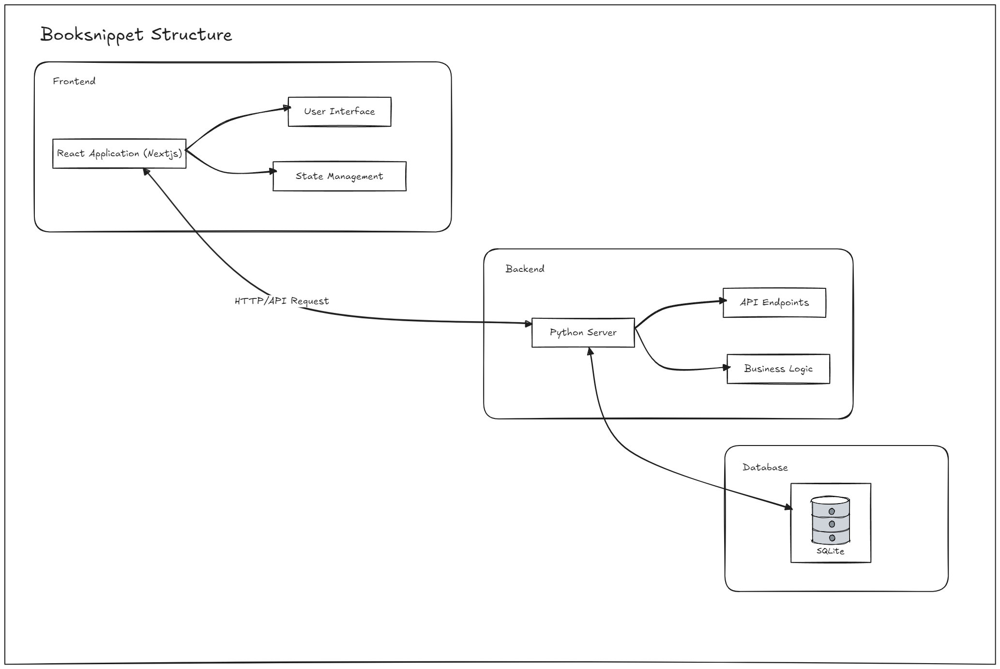

# Final Project (Team 1)

This repository contains the full structure for a DevOps final project, which consists of a backend, frontend, CI/CD pipeline, Kubernetes configuration, and Terraform infrastructure setup.

## Folder Structure

- **backend/**:  
  Contains the backend source code. This is where the API logic resides, typically built using FastAPI, Python, and SQLite as the database. It includes all the necessary files like `main.py`, `Dockerfile`, and database models.

- **frontend/**:  
  Contains the frontend code of the project. This is likely a React.js or Next.js application, responsible for the user interface, communicating with the backend API, and presenting data to users. The folder may include files like `index.html`, `App.js`, and components.

- **ci/**:  
  This folder contains the Continuous Integration (CI) configuration, such as the Jenkins pipeline configuration or any related scripts. It handles tasks like building, testing, and deploying the application.

- **k8s/**:  
  This folder includes Kubernetes-related manifests. It contains configuration files such as `Deployment.yaml`, `Service.yaml`, and `Ingress.yaml` which describe how the application should be deployed and managed on Kubernetes.

- **terraform/**:  
  Contains the Terraform configuration files for provisioning the necessary cloud infrastructure. These files define resources such as EC2 instances, VPCs, EKS clusters, and other AWS resources required by the project.

- **.gitignore**:  
  Specifies intentionally untracked files to ignore. It ensures that sensitive information, build artifacts, and temporary files are not committed to the repository.

- **docker-compose.yml**:  
  Defines the services, networks, and volumes for running multi-container Docker applications. This file is used to manage both the frontend and backend containers, as well as other supporting services like databases.

- **Jenkinsfile**:  
  Contains the Jenkins pipeline script that defines the steps for Continuous Integration and Continuous Deployment (CI/CD), such as pulling the code from GitHub, building Docker images, running tests, and deploying the services.

- **Readme.md**:  
  This file provides an overview of the project, how to set it up, and details about its structure, features, and technologies used.

## Created By

This project was collaboratively developed by the following individuals:

1. **Mohamed Abdelazem** - Lead Scrum Master
2. **Hazem Amr**
3. **Hana Abdelbari**
4. **Ziad Elshazly**

---

This layout helps organize the project into distinct sections, enabling easier development, deployment, and infrastructure management.
Here's a markdown explanation of the Booksnippet Structure shown in the image:

# Booksnippet Structure

The Booksnippet application is structured into three main components:

## 1. Frontend

The frontend is built using a React Application (NextJS), which is responsible for:

- User Interface: Handling the presentation and user interactions.
- State Management: Managing the application's state.

## 2. Backend

The backend is powered by a Python Server, which handles:

- API Endpoints: Providing the necessary endpoints for the frontend to interact with.
- Business Logic: Implementing the core functionality of the application.

Communication between the frontend and backend is achieved through HTTP/API Requests.

## 3. Database

The application uses SQLite as its database system for data persistence.

### Data Flow

1. The React Application in the frontend sends HTTP/API requests to the Python Server in the backend.
2. The Python Server processes these requests, interacts with the SQLite database as needed, and sends responses back to the frontend.
3. The frontend then updates its state and user interface based on the received data.

This structure allows for a clear separation of concerns, with the frontend handling user interactions, the backend managing business logic and data processing, and the database taking care of data storage and retrieval.
